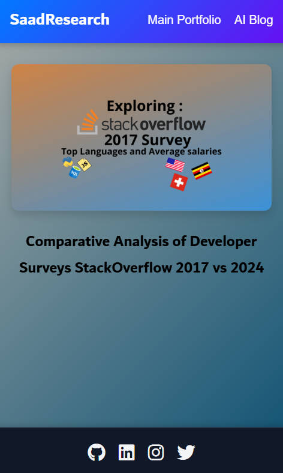
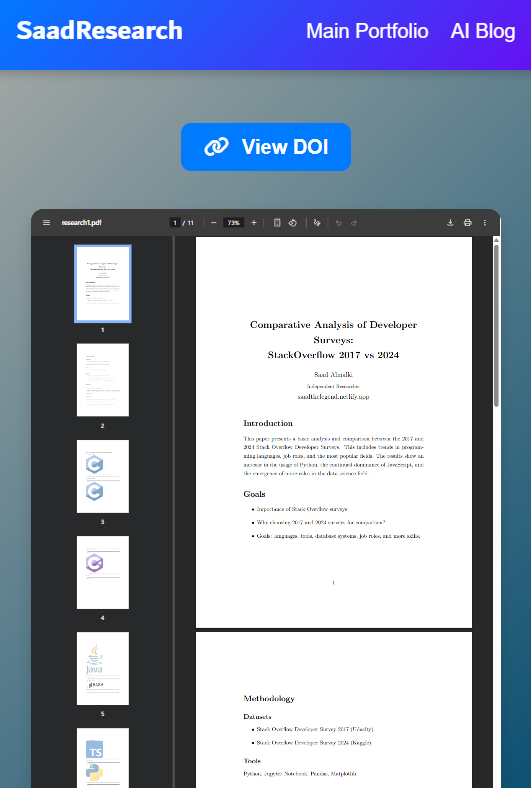
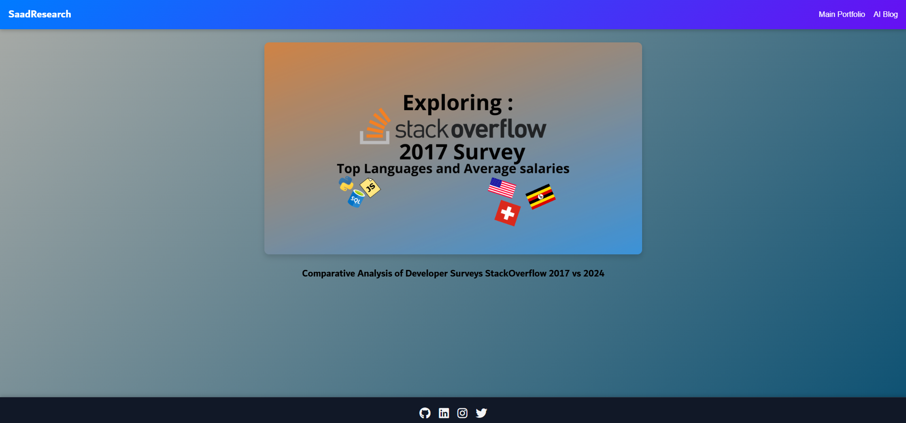

# Saad Researches app
First try with angular web framework development

## Goal
Collect and put my scientific researches in one place.

## Structure
- Front end : Angular - Vanilla CSS & [TarteebCSS](https://github.com/Saad711T/tarteebcss)
- Back end : there is no back end on site

## Preview
here is some pictures inside the webapp , enjoy to watch it :

#### Mobile :

##### PDF Reader :

#### Desktop :

### Credits
[0xSaad](https://x.com.0xdonzdev)